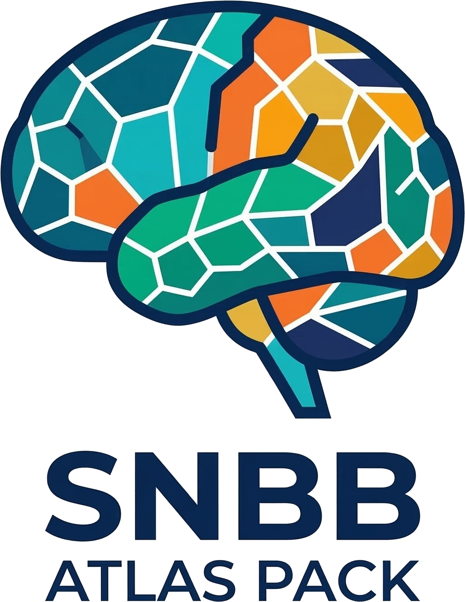

<p align="center">
  
</p>

# SNBB Atlas Pack

A BIDS-compatible parcellation atlas repository for the **Strauss Neuroplasticity Brain Bank (SNBB)**, providing atlases not shipped with [QSIRecon/PennLINC](https://github.com/PennLINC/AtlasPack). This dataset is managed with [DataLad](https://www.datalad.org/) and git-annex.

---

## Atlases Included

Each atlas lives in its own `atlas-<Name>/` directory and contains:
- An image file (NIfTI `.nii.gz` for volumetric, GIFTI `.label.gii` for surface)
- A `_dseg.tsv` lookup table with region metadata

### Tian Melbourne Subcortex Atlas (S1–S4)

> Tian et al. (2020). *Topographic organization of the human subcortex unveiled with functional connectivity gradients.* Nature Neuroscience. https://doi.org/10.1038/s41593-020-00711-6

Four hierarchical scales of subcortical parcellation derived from resting-state fMRI functional connectivity gradients (3T, MNI152NLin2009cAsym, 1 mm isotropic):

| Atlas | Regions | Structures |
|-------|---------|------------|
| `atlas-TianS1` | 16 | Hippocampus, Amygdala, Thalamus (ant/post), NAc, GP, Putamen, Caudate — bilateral |
| `atlas-TianS2` | 32 | Anterior/posterior subdivisions of S1 structures |
| `atlas-TianS3` | 50 | Further hippocampal and thalamic subdivisions |
| `atlas-TianS4` | 54 | Finest available granularity |

**Recommended for:** Subcortical-focused analyses (connectivity matrices, DWI tractography endpoint definition). Use S1 for coarse parcellation or when degrees of freedom are limited; S3/S4 when subcortical structure subdivision matters (e.g. thalamic nuclei, hippocampal subfields). Pairs naturally with any cortical atlas.

**TSV columns:** `index`, `label`, `name`, `hemisphere` (L/R), `structure`, `x_cog`, `y_cog`, `z_cog` (MNI mm)

### HCPex

> Huang et al. (2022). *[HCPex] An extended Human Connectome Project multimodal parcellation atlas of the human cortex.* NeuroImage. https://doi.org/10.1016/j.neuroimage.2022.119385

An extension of the HCP Multimodal Parcellation that adds 66 subcortical structures (7 bilateral pairs: hippocampus, amygdala, thalamus, striatum, etc.) to the 360 HCP-MMP cortical areas, yielding a single self-contained whole-brain volumetric atlas.

| Atlas | Regions | Space | Resolution |
|-------|---------|-------|------------|
| `atlas-HCPex` | 426 (360 cortical + 66 subcortical) | MNI152NLin2009cAsym | 1 mm |

**Recommended for:** Whole-brain volumetric connectivity matrices where cortex and subcortex must be in a single parcellation. The HCP-MMP cortical boundaries are multimodally-derived (myelin, cortical thickness, fMRI) and well validated. Good choice when comparing against literature using HCP-MMP cortical areas.

**TSV columns:** `index`, `label`, `name`, `hemisphere`, `lobe`, `cortex_type`, `region_id`, `r`, `g`, `b` (RGB), `x_cog`, `y_cog`, `z_cog`, `volume_mm3`

### HCP Multimodal Parcellation (HCP-MMP 1.0)

> Glasser et al. (2016). *A multi-modal parcellation of human cerebral cortex.* Nature. https://doi.org/10.1038/nature18933

The original 360-region (180/hemisphere) cortical parcellation in surface space. Derived from multimodal MRI data (myelin maps, cortical thickness, fMRI, and more) from 210 HCP subjects. Extracted from the HCP Q1–Q6 RelatedValidation210 CIFTI file distributed with the Tian 2020 MSA.

| Atlas | Regions | Space | Format |
|-------|---------|-------|--------|
| `atlas-HCPMMP` | 360 | fsLR 32k | GIFTI `.label.gii` |

Files: `atlas-HCPMMP_space-fsLR_hemi-L_dseg.label.gii`, `atlas-HCPMMP_space-fsLR_hemi-R_dseg.label.gii`

**Recommended for:** Surface-based analyses, cortical morphology/thickness, and HCP-style pipelines (Connectome Workbench). Use when your data is already in fsLR 32k space. For volumetric cortical analysis, prefer `atlas-HCPex` instead.

**TSV columns:** `index`, `label`, `name`, `hemisphere`, `region_abbrev`, `lobe`, `cortex_type`, `x_cog`, `y_cog`, `z_cog`, `volume_mm3`

### Schaefer2018 + Tian Combined Atlases

> Schaefer et al. (2018). *Local-Global Parcellation of the Human Cerebral Cortex from Intrinsic Functional Connectivity MRI.* Cerebral Cortex. https://doi.org/10.1093/cercor/bhx179

40 whole-brain volumetric atlases combining the Schaefer 2018 7-network cortical parcellation with the Tian subcortical atlas at all granularities (N ∈ {100, 200, …, 1000} cortical parcels × S ∈ {1, 2, 3, 4} subcortical scales).

| Name pattern | Regions | Space |
|--------------|---------|-------|
| `atlas-Schaefer2018N{N}n7Tian2020S{S}` | N + subcortical (116–1054) | MNI152NLin2009cAsym 1 mm |

**Recommended for:** Flexible whole-brain connectivity matrices at tunable resolution. Schaefer 2018 is one of the most widely cited cortical parcellations, facilitating comparison with existing literature. N=200–400 + S1 is a practical default; use higher N or S when higher spatial resolution is warranted. The 7-network labeling (Vis, SomMot, DorsAttn, SalVentAttn, Limbic, Cont, Default) enables network-level analyses directly from the TSV.

**TSV columns:** `index`, `label`, `name`, `hemisphere`, `network`, `component`

---

## Visualizations

Atlas figures are generated with [yabplot](https://github.com/GalKepler/yabplot) and saved to `atlases/<atlas-name>/figures/`. Intermediate mesh and vertex data is cached in `derivatives/yabplot/` so subsequent plots are fast.

```bash
# Generate all atlas figures (requires a built atlas pack)
uv run python scripts/visualize_atlases.py
```

Each atlas produces one or two PNGs:

| Atlas family | Figures generated |
|---|---|
| `atlas-TianS{N}` | `atlas-TianS{N}_subcortical.png` |
| `atlas-HCPex` | `atlas-HCPex_cortical.png`, `atlas-HCPex_subcortical.png` |
| `atlas-HCPMMP` | `atlas-HCPMMP_cortical.png` |
| `atlas-Schaefer2018N{N}n7Tian2020S{S}` | `…_cortical.png`, `…_subcortical.png` |

---

## Atlases Not Included (QSIRecon / PennLINC)

The following atlases are already distributed by [QSIRecon's AtlasPack](https://github.com/PennLINC/AtlasPack) and are therefore **not** included here to avoid duplication.

| Atlas | Regions | Notes |
|-------|---------|-------|
| **4S series** (4S156 – 4S1056) | 156–1056 | Schaefer2018 cortex + CIT168 subcortex + HCP thalamus + MDTB10 cerebellum + HCP hippocampus/amygdala; 10 variants |
| **Schaefer 2018** | 100–1000 | 7- and 17-network solutions |
| **AAL** | 116 | Tzourio-Mazoyer et al. |
| **AICHA384Ext** | 384 | Joliot et al., extended subcortical |
| **Brainnetome246Ext** | 246 | Fan et al., extended subcortical |
| **Gordon333Ext** | 333 | Gordon et al., extended subcortical |

### Getting QSIRecon Atlases

**Option 1 — DataLad clone (recommended, preserves version history):**
```bash
datalad clone https://github.com/PennLINC/AtlasPack
cd AtlasPack
datalad get atlas-4S456Parcels/  # download specific atlas
```

**Option 2 — TemplateFlow Python client:**
```python
import templateflow.api as tflow
files = tflow.get('MNI152NLin2009cAsym', atlas='Schaefer2018', resolution=1)
```

**Option 3 — Inside QSIRecon containers:** atlases are pre-bundled in the QSIRecon Docker/Singularity image under `/opt/templateflow/`.

---

## Usage

### Fetch Pre-built Atlases (no build required)

Clone the DataLad dataset and download only the atlases you need — no Python environment or source data required:

```bash
datalad clone https://github.com/GalKepler/snbb-atlas-pack
cd snbb-atlas-pack

# Download a single atlas
datalad get atlases/atlas-TianS1/

# Download all Tian scales
datalad get atlases/atlas-TianS*/

# Download all atlases (~GB-scale; omit path to get everything)
datalad get atlases/
```

Atlas files are git-annexed; the repository metadata (scripts, TSVs, docs) is lightweight and always present after cloning.

### Build / Regenerate All Atlases

```bash
# Activate the environment (or prefix commands with `uv run`)
source .venv/bin/activate

# Regenerate all atlas-*/ directories from source data
python main.py
```

This reads raw source files (Tian MSA and HCPex source data) and writes the BIDS-structured output into `atlases/` directories. Safe to re-run; existing files are overwritten.

### DataLad Save After Build

```bash
datalad save -m "Rebuild all atlases"
```

Use `datalad save` (not `git commit`) so that NIfTI/GIFTI files are properly annexed.

### Using Atlas Files in Python

```python
import nibabel as nib
import pandas as pd

# Volumetric atlas (Tian, HCPex, Schaefer+Tian)
img = nib.load("atlases/atlas-TianS1/atlas-TianS1_space-MNI152NLin2009cAsym_res-01_dseg.nii.gz")
tsv = pd.read_csv("atlases/atlas-TianS1/atlas-TianS1_dseg.tsv", sep="\t")

# Surface atlas (HCPMMP, fsLR 32k)
gifti = nib.load("atlases/atlas-HCPMMP/atlas-HCPMMP_space-fsLR_hemi-L_dseg.label.gii")
labels = gifti.darrays[0].data  # shape: (32492,)
```

### Using Prebuilt yabplot Meshes

After running `scripts/visualize_atlases.py` once, mesh and vertex data is cached in `derivatives/yabplot/`. You can reuse it for custom plots without rebuilding:

```python
import yabplot as yab

# Plot subcortical atlas regions (Tian or HCPex subcortex)
# Pass your own per-region data array, or None for a plain parcellation view
yab.plot_subcortical(
    data=None,                                        # array of length n_regions, or None
    custom_atlas_path="derivatives/yabplot/atlas-TianS1",
    export_path="my_subcortical_figure.png",
    display_type="none",
)

# Plot cortical atlas regions (HCPex, HCPMMP, or Schaefer+Tian cortex)
yab.plot_cortical(
    data=None,
    custom_atlas_path="derivatives/yabplot/atlas-HCPex",
    export_path="my_cortical_figure.png",
    display_type="none",
)
```

**Schaefer+Tian subcortical meshes are shared:** all `atlas-Schaefer2018N{N}n7Tian2020S{S}` atlases reuse the prebuilt Tian mesh at `derivatives/yabplot/atlas-TianS{S}/`. If you have built any Schaefer+TianS1 variant, subcortical plotting for all Schaefer+TianS1 combinations is free.

```python
# Subcortical plot for any Schaefer+TianS2 combination — reuses TianS2 meshes
yab.plot_subcortical(
    data=None,
    custom_atlas_path="derivatives/yabplot/atlas-TianS2",
    export_path="schaefer200_tians2_subcortical.png",
    display_type="none",
)
```

---

## Adding a New Atlas

1. **Add source data** — place raw files in `sourcedata/<AtlasName>/` (or point to an external path).

2. **Create a processing module** — add `scripts/atlas_<name>.py` with a `build(base: Path) -> None` function following the pattern of the existing modules:
   - Copy/convert the NIfTI or GIFTI to `atlas-<Name>/atlas-<Name>_space-<space>_<res>_dseg.<ext>`
   - Write a TSV to `atlas-<Name>/atlas-<Name>_dseg.tsv` using `utils.write_tsv()`
   - At minimum include columns: `index`, `label`, `name`, `hemisphere`

3. **Register in the orchestrator** — import and call your module in `scripts/build_atlas_pack.py`:
   ```python
   from scripts import atlas_<name>
   # inside build():
   atlas_<name>.build(BASE)
   ```

4. **Add citation to `dataset_description.json`** — update `DATASET_DESCRIPTION["ReferencesAndLinks"]` in `scripts/build_atlas_pack.py`.

5. **Test:**
   ```bash
   python main.py
   # Verify the new atlas directory has the expected files:
   ls atlas-<Name>/
   # Check row count matches expected region count:
   python -c "import pandas as pd; df=pd.read_csv('atlas-<Name>/atlas-<Name>_dseg.tsv', sep='\t'); print(len(df))"
   ```

6. **Save:**
   ```bash
   datalad save -m "Add atlas-<Name>"
   ```

### BIDS Naming Reference

| Entity | Example | Notes |
|--------|---------|-------|
| `atlas-` | `TianS1`, `HCPex`, `HCPMMP` | CamelCase, no hyphens |
| `space-` | `MNI152NLin2009cAsym`, `fsLR`, `fsaverage` | Use templateflow space names |
| `res-` | `01` (1 mm), `02` (2 mm) | Only for volumetric, omit for surface |
| `hemi-` | `L`, `R` | Required for per-hemisphere surface files |
| `_dseg` | — | Suffix for discrete segmentation (label map) |
| `_dseg.tsv` | — | Lookup table; no space/res/hemi entities |

---

## Publishing to DataLad

This dataset is already a DataLad dataset (see `.datalad/config`). To make it publicly accessible:

### 1. Commit current state

```bash
datalad save -m "Initial atlas pack build"
```

### 2. Create a sibling on GitHub (or GitLab)

```bash
# Requires a GitHub personal access token in your keyring
datalad create-sibling-github \
    --dataset . \
    --name github \
    --github-organization <your-org-or-username> \
    snbb-atlas-pack
```

### 3. Configure storage for annexed files

The NIfTI/GIFTI files are annexed (not stored in git). Options:

**Option A — Push to a RIA (Remote Indexed Archive) store** (best for institutional storage):
```bash
datalad create-sibling-ria \
    --dataset . \
    --name ria \
    "ria+ssh://hostname/path/to/ria-store"

# Set RIA as the annex remote for annexed data
datalad siblings configure --name github --annex-wanted "not largerthan=0"
datalad push --to ria      # push data
datalad push --to github   # push metadata + scripts
```

**Option B — Push annexed data directly to GitHub via git-annex special remote** (smaller datasets):
```bash
git annex initremote github-annex type=git url=<github-url>
datalad push --to github
```

**Option C — OSF (Open Science Framework)**:
```bash
pip install datalad-osf
datalad create-sibling-osf --dataset . --name osf --title "SNBB Atlas Pack"
datalad push --to osf
```

### 4. Verify

```bash
datalad status          # should be clean
git log --oneline -5    # confirm commits
```

After publishing, others can access the dataset with:
```bash
datalad clone https://github.com/<org>/snbb-atlas-pack
cd snbb-atlas-pack
datalad get atlas-TianS1/  # download specific atlas
```

---

## Dependencies

Managed with [uv](https://docs.astral.sh/uv/). To install:

```bash
uv sync
```

Key dependencies:

| Package | Purpose |
|---------|---------|
| `nibabel` | NIfTI and GIFTI I/O, CIFTI parsing |
| `pandas` | TSV generation and label table merging |
| `numpy` | Array operations |
| `nilearn` | Neuroimaging utilities |
| `templateflow` | Standard space templates |

---

## Repository Structure

```
snbb_atlas_pack/
├── main.py                        # Entry point: runs the full build
├── dataset_description.json       # BIDS dataset metadata
├── scripts/
│   ├── build_atlas_pack.py        # Orchestrator
│   ├── atlas_tian.py              # Tian S1–S4 processing
│   ├── atlas_hcpex.py             # HCPex processing
│   ├── atlas_hcpmmp.py            # HCP-MMP surface atlas (extracted from CIFTI)
│   └── utils.py                   # Shared helpers
├── sourcedata/
│   └── HCPex/                     # Raw HCPex lookup tables and NIfTI
├── atlas-TianS1/  atlas-TianS2/  atlas-TianS3/  atlas-TianS4/
├── atlas-HCPex/
├── atlas-HCPMMP/
└── notebooks/
    └── hcpex.ipynb                # Exploratory notebook for HCPex merge logic
```

---

## License

`CC BY 4.0` — see `dataset_description.json`. Refer to the original atlas publications for any additional license terms specific to each atlas.
